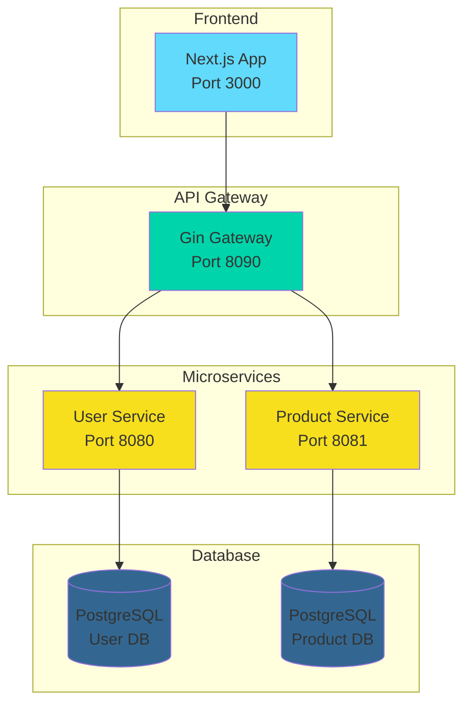

# 🧙‍♂️ Enchanted Microservices

A modern microservices architecture built with Go and Next.js, featuring user management, product catalog, and API gateway.


## 🏗️ Architecture



## 🚀 Features

- **User Management**: Registration, login, profile management with JWT authentication
- **Product Catalog**: Create, read, update, delete products with image upload
- **API Gateway**: Centralized routing and CORS handling
- **Modern UI**: Responsive design with animations and beautiful components
- **File Upload**: Image handling for products
- **Real-time Updates**: Dynamic product listing and management

## 🛠️ Tech Stack

### Backend
- **Go** with Gin framework
- **GORM** for database ORM
- **PostgreSQL** for data persistence
- **JWT** for authentication
- **Bcrypt** for password hashing

### Frontend
- **Next.js 15** with TypeScript
- **Tailwind CSS** for styling
- **Framer Motion** for animations
- **Axios** for API calls

### Infrastructure
- **Docker** for containerization
- **API Gateway** for service orchestration

## 🏃‍♂️ Quick Start

### Prerequisites
- Go 1.21+
- Node.js 18+
- PostgreSQL
- Docker (optional)

### Backend Setup
```bash
# Install dependencies
go mod tidy

# Set up environment variables
cp config.env.example config.env
# Edit config.env with your database credentials

# Run services
go run cmd/userservice/main.go &
go run cmd/productservice/main.go &
go run gin-gateway/main.go &
```

### Frontend Setup
```bash
cd frontend
npm install
npm run dev
```

### Database Setup
```sql
-- Create databases
CREATE DATABASE octopususerdb;
CREATE DATABASE octopusproductdb;
```

## 📁 Project Structure

```
enchanted-microservices/
├── cmd/
│   ├── userservice/     # User service entry point
│   └── productservice/  # Product service entry point
├── internal/
│   ├── userservice/     # User service logic
│   └── productservice/  # Product service logic
├── gin-gateway/         # API Gateway
├── frontend/            # Next.js application
└── config.env          # Environment variables
```

## 🔧 API Endpoints

### User Service (Port 8080)
- `POST /register` - User registration
- `POST /login` - User login
- `GET /profile` - Get user profile
- `PUT /profile` - Update user profile

### Product Service (Port 8081)
- `GET /products` - Get all products
- `POST /products` - Create product
- `GET /my-products` - Get user's products
- `PUT /products/:id` - Update product
- `DELETE /products/:id` - Delete product
- `POST /products/:id/image` - Upload product image

### API Gateway (Port 8090)
- `GET /products` - Proxy to product service
- `POST /products` - Proxy to product service
- `GET /user/*` - Proxy to user service
- `GET /my-products` - Proxy to product service

## 🎨 Screenshots

The application features a modern, responsive design with:
- Ocean-themed login page
- Dynamic product catalog
- User dashboard with profile management
- Product creation and editing modals
- Real-time image uploads

## 🤝 Contributing

1. Fork the repository
2. Create your feature branch (`git checkout -b feature/amazing-feature`)
3. Commit your changes (`git commit -m 'Add some amazing feature'`)
4. Push to the branch (`git push origin feature/amazing-feature`)
5. Open a Pull Request

## 📄 License

This project is licensed under the MIT License - see the [LICENSE](LICENSE) file for details.

## 👨‍💻 Author

**Öztürk Enis**
- GitHub: [@ozturkeniss](https://github.com/ozturkeniss)

---

⭐ Star this repository if you found it helpful!
